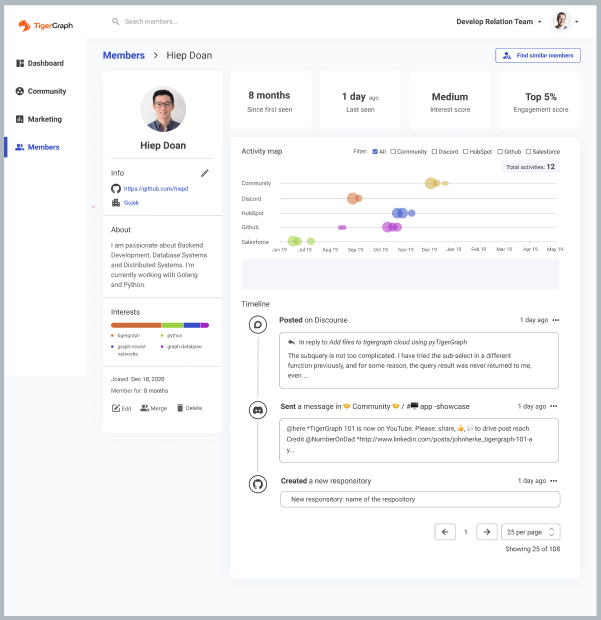

#Exquisite Examples 🥳

We've established the  power of fullstack and TigerGraph.  To further solidify
these claims, we can take a look at the **following applications** put together
using TigerGraph 😊.

<!-- > New feature, coming soon! If you wish to feature your applications here, make sure to be on the
> lookout for a submission form under the **_Community_** tab. Currently in the works!
&nbsp; &nbsp; -->

### TigerGraph C360

&nbsp; &nbsp;

&nbsp; &nbsp;

Want to learn how to create your own? Make sure to check out the **_Course Chapters_** tab.

Happy developing! 🥳🥳🥳

&nbsp; &nbsp;
