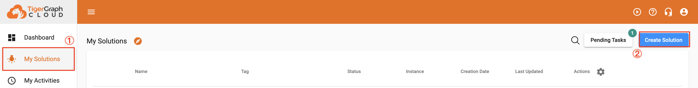

With the tool installed, we are now ready to <font color='#DD6E0F'>create a react project</font> folder! First, it’s good practice to create a bigger scope project folder named `tigergraph_fullstack`.

```
mkdir tigergraph_fullstack
cd tigergraph_fullstack
```

Next, we create a React project with npx:

```
npx create-react-app front
```

After the create React project command, you should see the terminal prints:

{++We suggest that you begin by typing:++}

{++cd front++}

{++npm start++}

Now, we can open our `tigergraph_fullstack` project with vscode and open the terminal inside vscode as well. This can be done with a shortcut: ctrl + \`

&nbsp; &nbsp;

Without further ado, let’s install some libraies and start our React project!

```
tigergraph_fullstack$ cd front
front$ npm i axios @antv/g6
front$ npm start

Compiled successfully!

You can now view front in the browser.

  Local:            http://localhost:3000
  On Your Network:  http://192.168.50.45:3000

Note that the development build is not optimized.
To create a production build, use npm build.
```

With the above lines, we have created our frontend project folder named front, and we have also run the project by using the command npm start” inside the project folder (front).

Now, we can use a browser to open the project with URL: http://localhost:3000

Awesome! Next up, let’s examine the middleware, an essential part of our project.

&nbsp; &nbsp;

## Middleware

### Python Virtual Environment

To start off, we'll create a python virtual enviroment (venv). A venv is a tool which keeps different dependencies of different projects ioslated. Hence, using this, we won't have to pip install all of the packages on each new project.

Step I. Create Middleware Directory:<br>
Let's create a middleware directory in parralle to the front directory

```
tigergraph-fullstack$ mkdir middleware
tigergraph-fullstack$ cd middleware
```

The inside of tigergraph-fullstack project directory looks like below:

```
.
├─ front
└─ middleware
```

Step II. Create your Virtual Environment:<br>
Now using Python, we can create a virtual environment using venv and Python.

```
middleware$ python3 -m venv venv
```

Awesome! Now, this create a folder called "venv" in our directory. We can then activate this virtual environment using:

```
middleware$ source venv/bin/activate
```

After running activate the virtual enviroment, you should see a (venv) in front of your terminal.

Step III. Install Packages:<br>
For this project, we’ll be using pyTigerGraph and FastAPI. FastAPI also uses a library called [uvicorn](https://www.uvicorn.org/), so we’ll install that as well.

```
middleware$ pip install pyTigerGraph fastapi uvicorn
```

Perfect! After running this, we should be ready to go!

### FastAPI

Step I. Create a Basic API:<br>
Now, let’s create our first basic API. First, let’s create a file called “main.py.”

```
touch main.py
```

Click into it, and then use the code from the [FastAPI website](https://fastapi.tiangolo.com/) in that file.

```
from typing import Optional
from fastapi import FastAPI
app = FastAPI()
@app.get("/")
def read_root():
     return {"Hello": "World"}
@app.get("/items/{item_id}")
def read_item(item_id: int, q: Optional[str] = None):
     return {"item_id": item_id, "q": q}
```

Step II. Run the API:<br>
Save main.py then run it with the command.

```
uvicorn main:app --reload
```

Here, we’re using uvicorn to run our file. The filename is main and the --reload has the server automatically reload after we save new changes to the file.

Step III. Explore the Custom Endpoints:<br>
Open a browser to the page https://127.0.0.1:8000. There, you’ll find the {“Hello”: “World”} from the first function.


Now, let’s go to https://127.0.0.1:8000/items/1. That will result in {“item_id”:1,”q”:null}.

The “item_id” is the parameter we passed into it (the /1), but we didn’t pass a q in this case.


Let’s give q a value by going to https://127.0.0.1:8000/items/1?q=test.


Perfect! Here, we passed the optional parameter q as test for the items endpoint.

Step IV. Explore the Prebuilt Endpoints:<br>
Finally, FastAPI has a 2 prebuilt endpoints dedicated for API documentation. First, if you go to http://127.0.0.1:8000/docs, you’ll find interactive documentation for the endpoints we created.


If you go to http://127.0.0.1:8000/redoc, you’ll find a different style of documentation.


And with that, let’s now setup the [TigerGraph Cloud](https://tgcloud.io/).

## TigerGraph Cloud

Step I. Create your Solution:<br>
Navigate to [TigerGraph Cloud](https://tgcloud.io/) and create an account if you haven’t already.


Once logged in, navigate to the ⓵ [“My Solutions” tab](https://tgcloud.io/app/solutionsti). Next, press the blue ⓶ “Create Solution” button.



We’ll be using COVID-19 Analysis v3.1.5 starter kit. To select it, either scroll down or select the “Geospatial Analysis” category and click on the COVID-19 option. Once it’s selected, press “Next.”


On the next page, don’t change anything, scroll down, and press “Next.”


Customize the third page to best describe your graph. Here, keep note of your password and subdomain, as we’ll be using this in pyTigerGraph. Press next.

(Write down your subdomain and password)


On the final page, review that everything looks good, then press “Submit.”


(This may take a few minutes)

Once the dot by your solution is green and says “Ready,” then it's ready to create fullstack.


