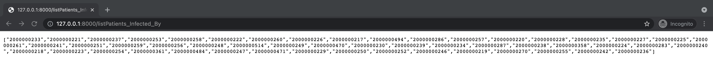
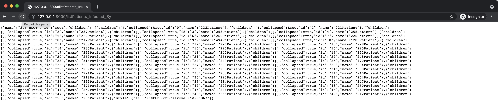

# Middleware

**Step I. Connect to your TigerGraph Cloud Solution: <br>**
Perfect! Now we’re ready to integrate pyTigerGraph into our API. Open `main.py` in your editor of choice and import pyTigerGraph.

```
import pyTigerGraph as tg
```

To make this safer, create a configs.py file and import the credentials from there.

```
touch configs.py
```

In configs.py:

```
HOST='https://covid-fullstack.i.tgcloud.io'
USERNAME='tigergraph'
PASSWORD='tigergraph'
GRAPHNAME='MyGraph'
```

Let's come back to `main.py`, create a connection to your TigerGraph Cloud server.

```
import config as Credential
conn = tg.TigerGraphConnection(host=Credential.HOST, username=Credential.USERNAME, password=Credential.PASSWORD, graphname=Credential.GRAPHNAME)
conn.apiToken = conn.getToken(conn.createSecret())
```

If this runs successfully, then you’re connected to TigerGraph Cloud! Congrats!

**Step II. Establish the Cross-Origin Resource Sharing (CORS): <br>**
Since the communication between front and middleware don't specify a port, it is essential configure the CORS.<br>
<br>
Let's import CORSMiddleware in `main.py`

```
from fastapi.middleware.cors import CORSMiddleware
```

Create a list of allowed origins (as strings).

```
origins = [
    "http://localhost:3000",
    "https://localhost:3000",
]
```

Sspecify the middleware allows:

- Credentials (Authorization headers, Cookies, etc).<br>
- Specific `HTTP` methods (`POST`, `PUT`) or all of them with the wildcard "\*".
- Specific `HTTP` headers or all of them with the wildcard "\*".

```
app.add_middleware(
    CORSMiddleware,
    allow_origins=origins,
    allow_credentials=True,
    allow_methods=["*"],
    allow_headers=["*"],
)
```

**Step III. Create Query Endpoints: <br>**
Let’s first run TigerGraph queries with FastAPI, starting with listPatients_Infected_By.

```
@app.get("/listPatients_Infected_By")
def readListPatients_Infected_By():
    gQuery = conn.runInstalledQuery("listPatients_Infected_By", {"p":2000000205})[0]['Infected_Patients']
    return gQuery
```

Break this down, we're running the `listPatients_Infected_By` query that is installed in GraphStudio. As the query parameter takes the Patient Vertex ID, the output return a list of infected Patients' ID.

If you haven’t already, run the file. Open http://127.0.0.1:8000/listPatients_Infected_By to run the query.



Awesome! Now, the data need to be transform into nested tree json format with keys like name (String), id (String), and children (list of objects).

After adding the data transformation, the `GET` method of `listPatients_Infected_By` would look like this

```
@app.get("/listPatients_Infected_By")
def readListPatients_Infected_By():
    gQuery = conn.runInstalledQuery("listPatients_Infected_By", {"p":2000000205})[0]['Infected_Patients']
    count = 0
    children = []
    for p in gQuery:
        children.append({
        "children": [],
        "collapsed": True,
        "id": str(count),
        "name": p[-3:] + "Patient",

        })
        count+=1

    result = {
        "name": "205 ROOT",
        "id": "root",
        "children": children,
        "style": {
            "fill": "#FFDBD9",
            "stroke":  "#FF6D67"
        }
    }
    return result
```

If you open the endpoint http://127.0.0.1:8000/listPatients_Infected_By, again.<br>
You will see this!



You have transform the data, and the data is ready for the frontend and AntV G6.

👏 Great job! 👏 You have create a `GET` method API using TigerGraph Cloud and FastAPI & pyTigerGraph!
