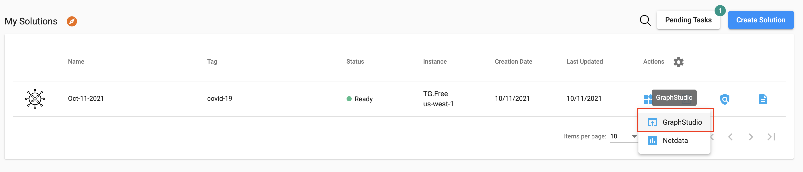
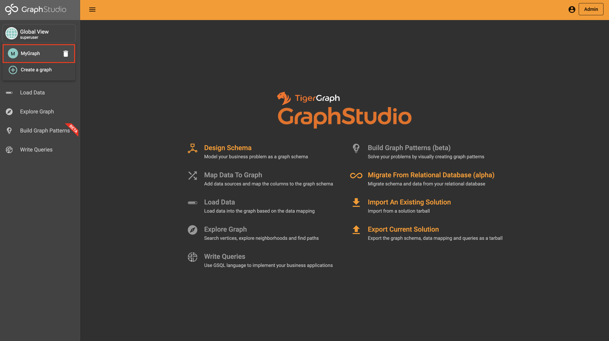
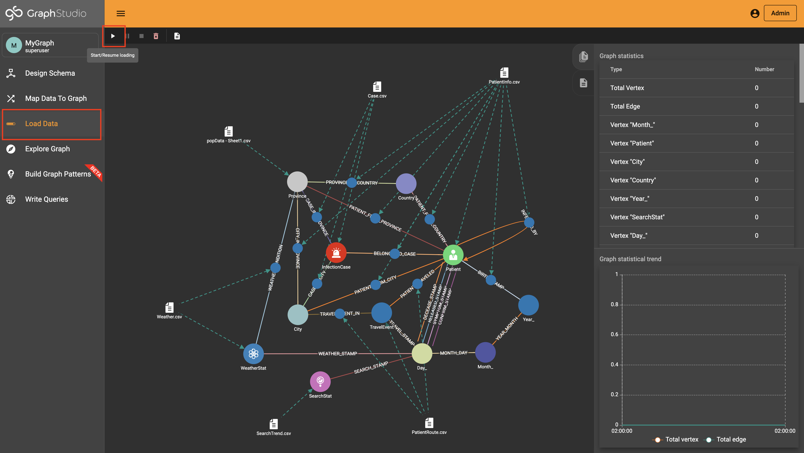
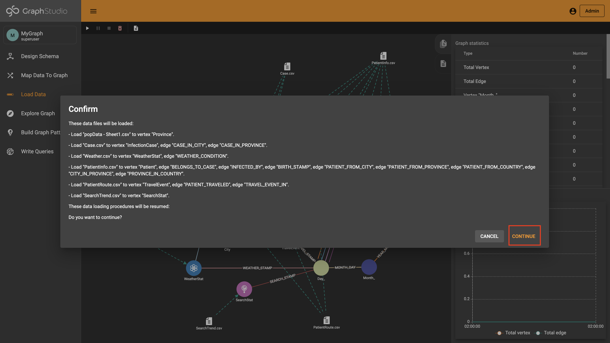
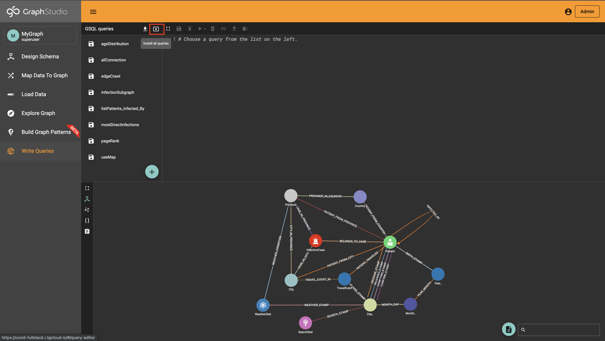
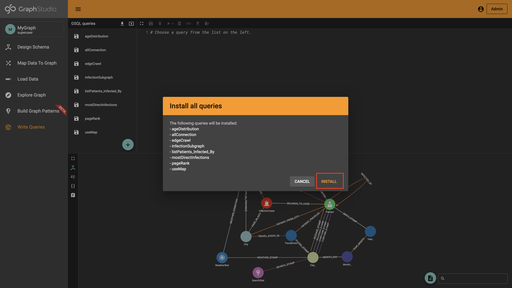
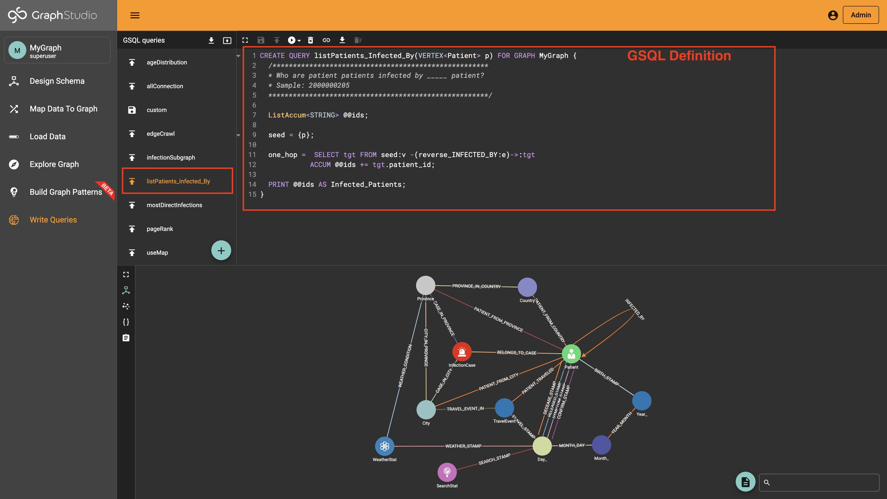
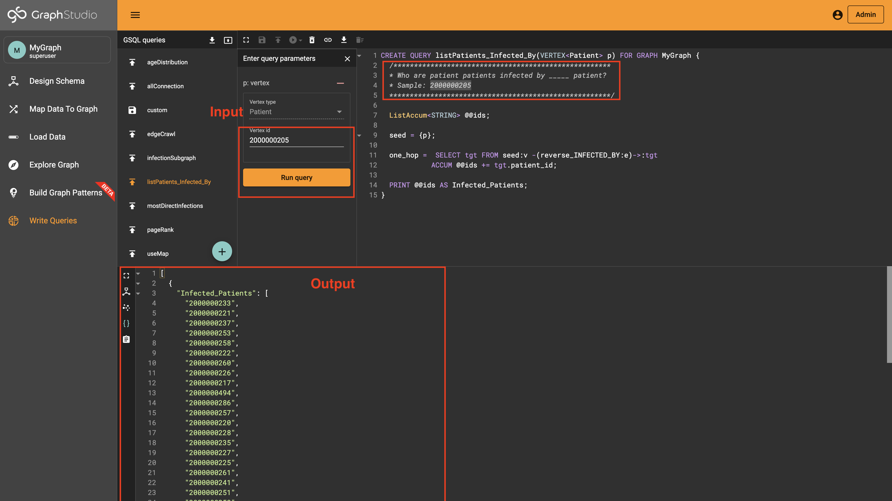

## Step I. Exploring the solution dataset

To do this, open GraphStudio by going to "Applications Icon" and clicked on "GraphStudio" from the dropdown.

## Step II. Select MyGraph

In the tab that opens, click "Global View" in the top left corner then select "MyGraph" from the dropdown to enter the MyGraph graph.

## Step III. Data loading

To do this, click the “Load Data” tab then press the play button with the hover value of “Start/Resume loading.”

Click on the contune to proceed the loading.

## Step IV. GSQL Queries

Perfect! Next, we’ll install all the queries. To do this, go to the “Write Queries” tab and press the box with an up arrow.

This tutorial will use the exiting query to demonstrate the fullstack. In this case, the GQSL query used in the tutorial is "listPatients_Infected_By".

This query finds the patient infected by the input of "Patient Vertex ID" (2000000205). Therefore, the query outputs a list of Infected_Patients by the Patient Vertex ID (2000000205).

In addition, GraphStudio allows create your own custom GSQL queries!
If you want to learn more about TigerGraph Cloud, check out [this blog](https://www.tigergraph.com/blog/getting-started-with-tigergraph-3-0/).
