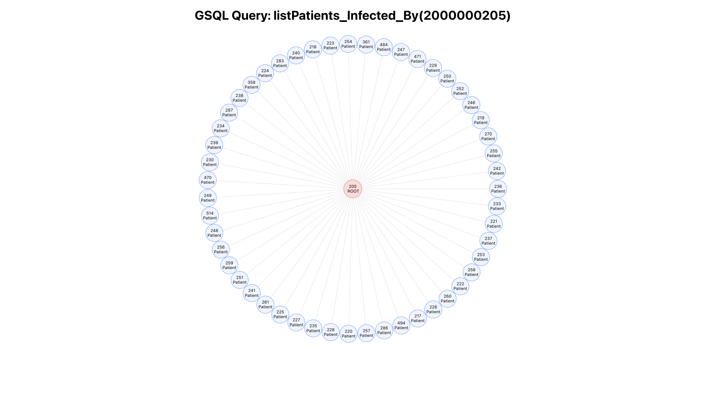
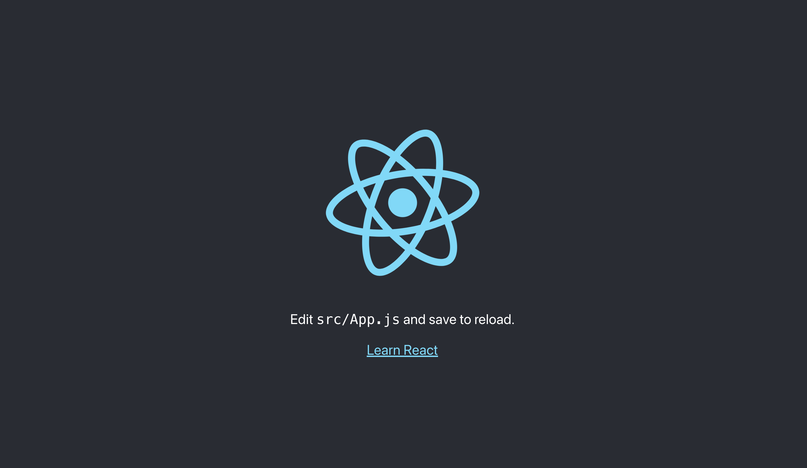
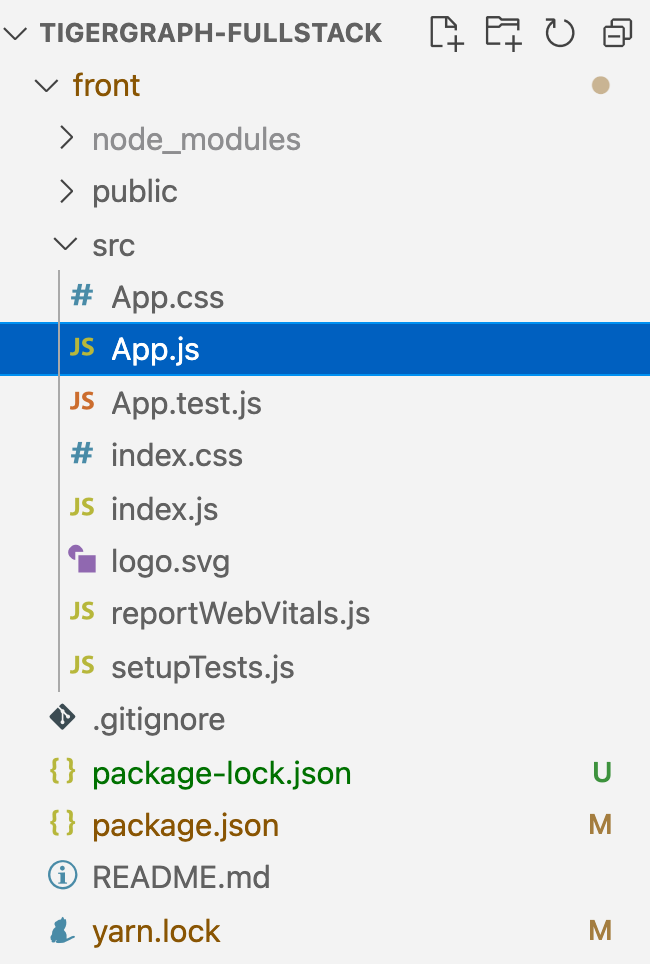
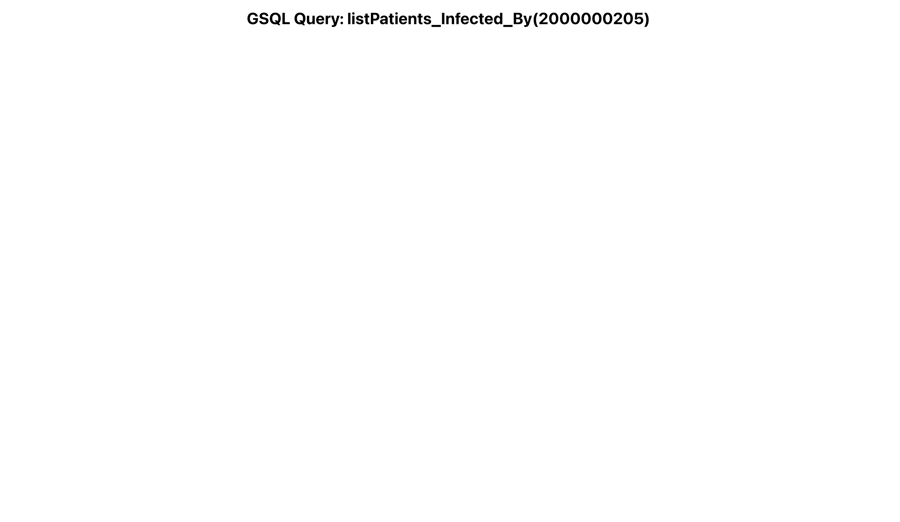

# Frontend

**Introduction**<br>
The object to is create a simple tree graph using AntV G6 from TigerGraph Cloud and Middlware.

> Like below:

{: style="border-style: inset;"}

&nbsp; &nbsp;

**Step I. Resume: <br>**
Let's continue where we left off from the frontend setup. If the React project is off then execute the project!

```
tigergraph-fullstack$ cd front
front$ npm start

Compiled successfully!

You can now view front in the browser.

  Local:            http://localhost:3000
  On Your Network:  http://192.168.50.45:3000

Note that the development build is not optimized.
To create a production build, use npm build.
```

Now, we can use a browser to open the project with URL: [http://localhost:3000](http://localhost:3000)


&nbsp; &nbsp;

**Step II. Removeing the Hello World: <br>**
The npx creates the React project with the files and folder structure. Let's open the file 'App.js' located in '/tigergraph-fullstack/front/src/App.js'

{: style="height:300px;width:240px"}

Replace the code over the current existing code in 'App.js'.

```
import './App.css';

import React, { Component } from 'react';

class App extends Component {
  render() {
    return (
      <div className="App">
        <h1>GSQL Query: listPatients_Infected_By(2000000205)</h1>
      </div>
    );
  }
}

export default App;
```

We replaced the React Functional Component with React Class Component. In addition, we added a h1 tag and giving div tag a class name called 'App' which is from the import of 'App,css'.

Afterward the [http://localhost:3000](http://localhost:3000) will show this.

{: style="border-style: inset;"}

From the header/h1 information, we are going to create a graph showing a list of patients infected by the vertex id of 2000000205.

&nbsp; &nbsp;

**Step III. Libraries: <br>**
Let's import all the libraies inside the 'App.js' on first two lines.

```
import axios from 'axios';
import G6 from '@antv/g6';
```

[AntV G6](https://antv.vision/en) will be used in this tutorial which is a new generation of data visualization solution from Ant Group. In addition, Axios provides a small package with a very extensible interface. [Learn more](https://axios-http.com/)

&nbsp; &nbsp;

**Step IV. Loading Data at front: <br>**
Three key points to cover from loading the data at frontend which are 1) React constructor, 2) React life Cycle, and 3) Axios (HTTP request).
<br/>
<br/>1) The React constructor is a method that's automatically called during the creation of an object from a class. Therefore, it is used to bind event handlers to the components. In other words, we will use to create a state to store data object.

```
constructor() {
super();
this.state = { data: [] };
}
```

<br/>2) Life cycle in particular of componentDidMount() method runs after the component output has been rendered to the DOM.

```
componentDidMount() {}
```

<br/>3) Axios is a simple promise based HTTP client which use in React to make request from the FastAPI endpoint.

```
axios.get('http://127.0.0.1:8000/listPatients_Infected_By').then((res) => {
    if (res.status === 200) {
    }
    })
    .catch((err) => {
    console.error(err);
    });
```

**The entire App.js: <br>**

```
import axios from 'axios';
import G6 from '@antv/g6';
import './App.css';
import React, { Component } from 'react';
class App extends Component {
  constructor() {
    super();
    this.state = { data: [] };
  }
  componentDidMount() {
    axios
      .get('http://127.0.0.1:8000/listPatients_Infected_By')
      .then((res) => {
        if (res.status === 200) {
        }
      })
      .catch((err) => {
        console.error(err);
      });
  }
  render() {
    return (
      <div className="App">
        <h1>GSQL Query: listPatients_Infected_By(2000000205)</h1>
      </div>
    );
  }
}
export default App;
```

The axios is making the request to 'http://127.0.0.1:8000/listPatients_Infected_By' and it is executed inside the componentDidMount method scope; Once the component is rendered onto the DOM then the life cycle executed the code inside of itself!

&nbsp; &nbsp;

**Step V. Data preparing with AntV G6: <br>**
Great job!<br>
Next, the frontend prepares the response data, which is a json format for the AntV G6. The response data is from listPatients_Infected_By which is a GET method API. Lastly, the data is set to the state and initiated the G6 visualization graph.

> Explanation on AntV G6 Implemenataion line by line:

```
/* The code block is setting the response data to the state and
get the container DOM id and its window info to render the graph.
*/
this.setState({ data: res.data });
const container = document.getElementById('container');
const width = container.scrollWidth || 1280;
const height = window.height || 800;

/* Create a TreeGraph and its configuration such as default node size, layout, and modes.
Learn more on AntV G6 API docs.
*/
const graph = new G6.TreeGraph({
container: 'container',
width,
height,
linkCenter: true,
modes: {
    default: [
    {
        type: 'collapse-expand',
        onChange: function onChange(item, collapsed) {
        const data = item.get('model');
        data.collapsed = collapsed;
        return true;
        },
    },
    'drag-canvas',
    'zoom-canvas',
    'drag-node',
    'activate-relations',
    ],
},
defaultNode: {
    size: 55,
},
layout: {
    type: 'dendrogram',
    direction: 'RL',
    nodeSep: 20,
    rankSep: 400,
    radial: true,
},
});

// Use the combo operation to set the style and other configurations for each node.
graph.node(function (node) {
return {
    label: `${node.name.slice(0, 3)}\n${node.name.slice(3)}`,
    size: node.children.length ? 52 : 50,
};
});


/* The response json data is in format of nested tree
using parents and children to represent the graph.
Hence, the json data is in one json object with all the infomation of nodes and edges.
*/
graph.data(this.state.data);

// Lastly, print out the graph with built-in animation from AntV G6.
graph.render();
graph.fitView();
graph.get('canvas').set('localRefresh', false);

graph.on('node:click', (evt) => {
const nodeItem = evt.item;
if (!nodeItem) return;
const item = nodeItem.getModel();
if (item.url) {
    window.open(item.url);
}
});

if (typeof window !== 'undefined')
window.onresize = () => {
    if (!graph || graph.get('destroyed')) return;
    if (
    !container ||
    !container.scrollWidth ||
    !container.scrollHeight
    )
    return;
    graph.changeSize(container.scrollWidth, container.scrollHeight);
};
```

&nbsp; &nbsp;

> Below is the entire code from App.js

```
import './App.css';
import React, { Component } from 'react';
import axios from 'axios';
import G6 from '@antv/g6';
class App extends Component {
  constructor() {
    super();
    this.state = { data: [] };
  }
  componentDidMount() {
    axios
      .get('http://127.0.0.1:8000/listPatients_Infected_By')
      .then((res) => {
        if (res.status === 200) {
          this.setState({ data: res.data });
          const container = document.getElementById('container');
          const width = container.scrollWidth || 1280;
          const height = window.height || 800;
          const graph = new G6.TreeGraph({
            container: 'container',
            width,
            height,
            linkCenter: true,
            modes: {
              default: [
                {
                  type: 'collapse-expand',
                  onChange: function onChange(item, collapsed) {
                    const data = item.get('model');
                    data.collapsed = collapsed;
                    return true;
                  },
                },
                'drag-canvas',
                'zoom-canvas',
                'drag-node',
                'activate-relations',
              ],
            },
            defaultNode: {
              size: 55,
            },
            layout: {
              type: 'dendrogram',
              direction: 'RL',
              nodeSep: 20,
              rankSep: 400,
              radial: true,
            },
          });
          graph.node(function (node) {
            return {
              label: `${node.name.slice(0, 3)}\n${node.name.slice(3)}`,
              size: node.children.length ? 52 : 50,
            };
          });
          graph.data(this.state.data);
          graph.render();
          graph.fitView();
          graph.get('canvas').set('localRefresh', false);
          graph.on('node:click', (evt) => {
            const nodeItem = evt.item;
            if (!nodeItem) return;
            const item = nodeItem.getModel();
            if (item.url) {
              window.open(item.url);
            }
          });
          if (typeof window !== 'undefined')
            window.onresize = () => {
              if (!graph || graph.get('destroyed')) return;
              if (
                !container ||
                !container.scrollWidth ||
                !container.scrollHeight
              )
                return;
              graph.changeSize(container.scrollWidth, container.scrollHeight);
            };
        }
      })
      .catch((err) => {
        console.error(err);
      });
  }
  render() {
    return (
      <div className="App">
        <h1>GSQL Query: listPatients_Infected_By(2000000205)</h1>
        <div id="container"></div>
      </div>
    );
  }
}
export default App;


```
