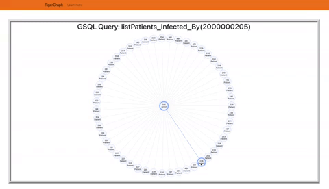

# Conclusion

## More Components and Error Handling

### More Components

First of all, change directory to react project front and npm install [React Boostrap](https://react-bootstrap.github.io/)

```
npm install react-bootstrap@next bootstrap@5.1.1
```

Import React Boostrap in `App.js`

```
import { Navbar, Container, Nav } from 'react-bootstrap';
import 'bootstrap/dist/css/bootstrap.min.css';
```

Let's create a header.<br>
Create the Navbar inside render function. The Navbar is in-between the `className App` and on top of `h1` element.

```
<>
    <Navbar style={{ backgroundColor: '#F78117', marginBottom: 24 }}>
        <Container>
            <Navbar.Brand href="#home">TigerGraph</Navbar.Brand>
            <Nav className="me-auto">
            <Nav.Link href="https://www.tigergraph.com/">
                Learn more
            </Nav.Link>
            </Nav>
        </Container>
    </Navbar>
</>
```

Let's add a border and margin for the Tree Graph Canvas.<br>
Wrap the `id container` and `h1` element with a div tag.

```
<div style={{ border: '4mm ridge #e3e3e3', margin: 50 }}>
    <h1>GSQL Query: listPatients_Infected_By(2000000205)</h1>
    <div id="container"></div>
</div>
```

### Error Handling

In `main.py` file adding `try` and `except` in between making connection on TigerGraph Cloud.

```
try:
     conn = tg.TigerGraphConnection(host=Credential.HOST, username=Credential.USERNAME, password=Credential.PASSWORD, graphname=Credential.GRAPHNAME)
     conn.apiToken = conn.getToken(conn.createSecret())
     app = FastAPI()
except Exception as e:
    import time
    print(e)
    time.sleep(50000)
```

Also, adding the `try` and `except` in between the `listPatients_Infected_By` API Endpoint

```
@app.get("/listPatients_Infected_By")
def readListPatients_Infected_By():
     try:
          gQuery = conn.runInstalledQuery("listPatients_Infected_By", {"p":2000000205})[0]['Infected_Patients']
          count = 0
          children = []
          for p in gQuery:
               children.append({
               "children": [],
               "collapsed": True,
               "id": str(count),
               "name": p[-3:] + "Patient",

               })
               count+=1

          result = {
               "name": "205 ROOT",
               "id": "root",
               "children": children,
               "style": {
                    "fill": "#FFDBD9",
                    "stroke":  "#FF6D67"
               }
          }
          return result
     except:
          return []
```

## 🎊 Congratulation! 🎊



### You have create a fullstack with 🐅 TigerGraph Cloud Graph Database!
